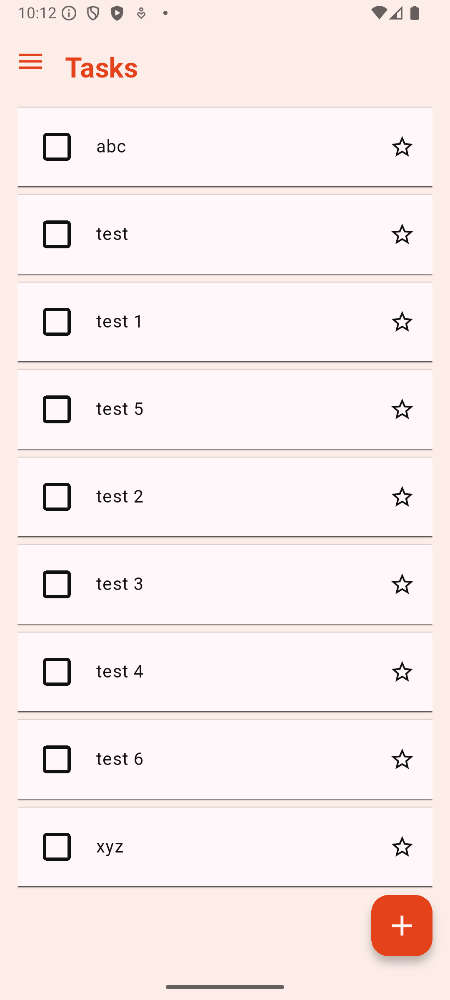

# todo

Simple Todo app using Flutter and Firebase

<p float="left">
  
  
</p>

## Setup

Generate files

```bash
$ dart run build_runner build
```

Generate localization files

```bash
$ flutter gen-l10n
```

Configure Firebase with FlutterFire CLI

```bash
$ flutterfire configure
```
